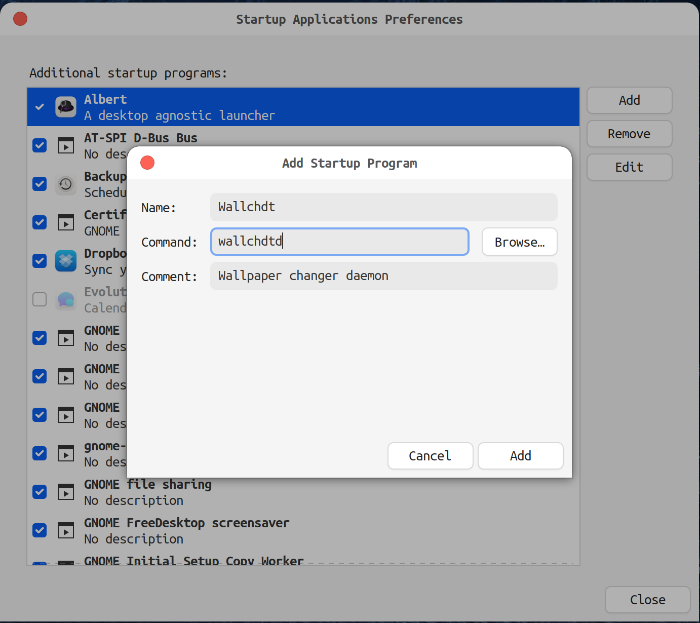
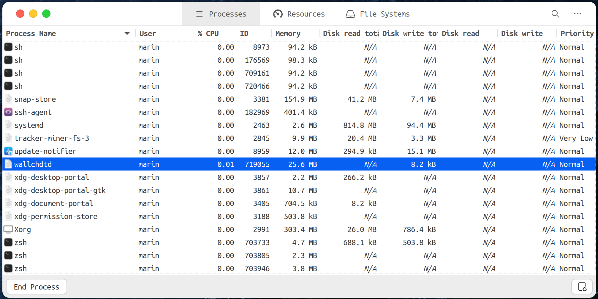

# Wallchdt

[](https://github.com/marinrusu1997/wallchdtd/actions/workflows/test.yml)


Wallpaper changer basing on times of the day for Ubuntu.


## Features

- 🌄 Change wallpapers based on sunlight time
- ⌚ Change wallpapers based on daytime

Want more? Open a new issue or 👍 an existing one so we can talk about it.

## Installation

Wallchdt is built upon [Node.js](https://nodejs.org/en/).

Requirements:

- `node` > 16
- `npm` > 7

Install Wallchdt as global npm package.
```shell
npm i -g wallchdtd
```
Start wallchdtd daemon.
```shell
wallchdtd
```
Add Wallchdt as startup program.


## Configuration
After installing and starting, daemon needs to be configured.
This is done via config file which is watched by daemon for modifications.
Daemon automatically picks up the latest changes in the config and applies them. <br/>

Create config file and edit it.
```shell
gedit ~/.config/wallchdtd/conf.json
```
After saving, your wallpaper should change to specified one.

### Change wallpapers by sunlight time
Wallchdt [automatically calculates sunlight time](https://www.npmjs.com/package/suncalc)
based on your location and current day. <br/> 
Location from the config file can be either specified explicitly:
```json
{
  "location": {
    "lat": 47,
    "long": 28
  }
}
```
Or, it can be determined based on your IP (requires active internet connection after configuration is saved).
In this case you need to provide [ipinfo.io token](https://ipinfo.io/account/token).
```json
{
  "location": "45609h6c68fgey"
}
```
Bellow is an example of config:
```json
{
    "changeBy": "sunlight",
    "location": "45609h6c68fgey",
    "wallpapersDir": "~/Pictures/Wallpapers/Mountains/",
    "wallpapers": {
        "dawn": "dawn.jpg",
        "sunrise": "sunrise.jpg",
        "noon": "noon.png",
        "sunset": "sunset.jpg",
        "dusk": "dusk.jpg",
        "night": "night.jpg"
    }
}
```
Notice that location will be determined automatically.
Also, we have optional property `wallpapersDir` which helps daemon resolve path to wallpapers.
You can also specify full path in the `wallpapers` section.
In the `wallpapers` we indicated wallpapers for all sunlight times, but you can also indicate wallpapers for only a few of them. 

### Change wallpapers by daytime
Wallchdt can also change wallpapers by specifying an explicit time of the day.
In this case `location` property is no longer needed. <br/>
Bellow is an example of config:
```json
{
    "changeBy": "daytime",
    "wallpapersDir": "~/Pictures/Wallpapers/Mountains/",
    "wallpapers": {
        "06:00": "sunrise.jpg",
        "10:00": "noon.png",
        "19:00": "sunset.jpg",
        "22:00": "night.jpg"
    }
}
```
Notice that `wallpapers` section needs to contain at least 2 entries.

## Troubleshooting

In case wallpaper is not changed, you can inspect daemon logs in order to check daemon actions.
```shell
tail -f ~/.local/state/wallchdtd/current.log
```
You can also check whether daemon is actually running via *System Monitor*.


## Bug report

If you want to report a bug, first, thanks a lot, that helps me a lot. <br/>
Please open an issue and mention your OS, your node and npm version, and how to reproduce it. <br/>
Adding log file `~/.local/state/wallchdtd/current.log` is a big help too.